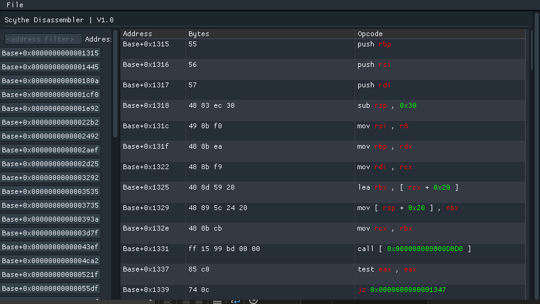

# ScytheDisassembler

Scythe Disassembler provides functionality to find and disassemble all functions in a dumped file. It relies on the Zydis library for disassembly and ImGui for demonstrating the address, bytes, and instructions in a user-friendly interface.



## Features

- **Function Discovery**: Automatically finds all functions within the provided dumped file.
- **Disassembly**: Uses Zydis to disassemble the discovered functions.
- **Visualization**: Displays the address, bytes, and disassembled instructions using ImGui.

- ## Requirements

- [Zydis](https://github.com/zyantific/zydis)
- [ImGui](https://github.com/ocornut/imgui)

## Installation

1. **Clone the Repository**:
 ```
   git clone https://github.com/yourusername/cpp-disassembler.git
   cd cpp-disassembler
```

